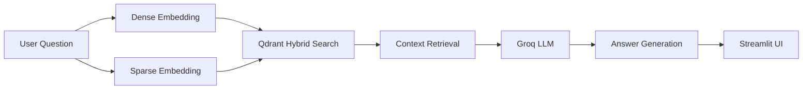

**Create a professional README for BioRAG-Hybrid:**

```bash
cd C:\Users\Dell\Documents\Rag_Based_Projects
notepad BioRAG-Hybrid\README.md
```

Copy and paste this:

```markdown
# 🔬 BioRAG-Hybrid

[](https://streamlit.io)
[](https://qdrant.tech)
[](https://groq.com)
[](https://python.org)

**Intelligent Medical Literature Search System** combining Hybrid Vector Search with Large Language Models for accurate, evidence-based answers from PubMed research papers.

## 📊 Performance Metrics

| Metric | Score |
|--------|-------|
| **Hit@1** | 98.0% |
| **Hit@3** | 100% |
| **Hit@5** | 100% |
| **MRR** | 0.990 |
| **F1-Score** | 0.981 |
| **Precision** | 0.984 |
| **Recall** | 0.980 |

## 🎯 Features

- **Hybrid Search**: Combines dense (semantic) + sparse (keyword) vectors using Qdrant
- **High Accuracy**: 98% exact match on PubMed QA benchmark
- **Fast LLM**: Groq's Llama 3.3 70B for rapid answer generation
- **Interactive UI**: Streamlit-based user interface with real-time feedback
- **Comprehensive Evaluation**: Hit@k, MRR, Precision, Recall, F1 metrics
- **Medical Focus**: Specialized for biomedical literature retrieval

## 🏗️ Architecture

```
User Query → Hybrid Search → Context Retrieval → Groq LLM → Answer
                    ↓
            Dense Vectors (Semantic)
                    +
            Sparse Vectors (Keyword)
                    ↓
              Qdrant Cloud
```

## 📁 Project Structure

```
BioRAG-Hybrid/
├── streamlit_app.py              # Main UI application
├── advance_evaluation_rag.py     # Evaluation metrics suite
├── hybrid_query.py               # Hybrid search engine
├── upload_hybrid_data.py         # Data ingestion pipeline
├── create_collection.py          # Qdrant collection setup
├── load_data.py                  # PubMed dataset loader
├── generate_embeddings.py        # Vector generation
├── hybrid_search_setup.py        # Hybrid index configuration
├── requirements.txt              # Dependencies
├── .gitignore                    # Git exclusions
└── README.md                     # Documentation
```

## 🚀 Quick Start

### Prerequisites

- Python 3.10 or higher
- Qdrant Cloud account (free tier)
- Groq API key (free tier)

### Installation

```bash
# Clone the repository
git clone https://github.com/Siddique-ur-Rehman/Rag_Based_Projects.git
cd Rag_Based_Projects/BioRAG-Hybrid

# Install dependencies
pip install -r requirements.txt
```

### Environment Setup

Create `.env` file:

```env
QDRANT_URL=https://your-cluster.cloud.qdrant.io:6333
QDRANT_API_KEY=your_qdrant_api_key
GROQ_API_KEY=your_groq_api_key
```

### Run the Application

```bash
streamlit run streamlit_app.py
```

## 🔧 Pipeline Steps

1. **Data Loading**: PubMed QA dataset (1000 samples)
2. **Vector Generation**: Sentence Transformers (all-MiniLM-L6-v2)
3. **Collection Setup**: Qdrant hybrid collection (dense + sparse)
4. **Data Upload**: 500 biomedical abstracts with dual vectors
5. **Hybrid Search**: RRF fusion for optimal retrieval
6. **LLM Generation**: Groq Llama 3.3 70B for answers
7. **Evaluation**: Comprehensive metrics calculation

## 📦 Tech Stack & Versions

| Technology | Version | Purpose |
|------------|---------|---------|
| Python | 3.10+ | Core language |
| Qdrant Client | 1.10.0 | Vector database |
| Sentence-Transformers | 2.2.2 | Dense embeddings |
| Fastembed | 0.2.0 | Sparse embeddings |
| Groq | 0.5.0 | LLM inference |
| Streamlit | 1.32.0 | Web UI |
| Datasets | 2.18.0 | PubMed QA data |
| Ragas | 0.1.5 | RAG evaluation |
| Scikit-learn | 1.3.0 | Metrics calculation |
| NumPy | 1.24.3 | Vector operations |

## 🧪 Evaluation Details

Tested on 50 PubMed QA samples:

```python
# Run evaluation
python advance_evaluation_rag.py
```

**Results interpretation:**
- **Hit@k**: Correct answer in top-k retrieved results
- **MRR**: Mean Reciprocal Rank (higher = better ranking)
- **F1**: Harmonic mean of precision and recall

## 💡 Example Queries

- "What causes Alzheimer's disease?"
- "What are the risk factors for heart disease?"
- "What are effective treatments for diabetes?"
- "Do mitochondria play a role in cellular remodeling?"

## 🔄 System Workflow



## 📈 Performance Optimization

- **Caching**: Model caching with `@st.cache_resource`
- **Batching**: Efficient vector generation for 500 samples
- **Hybrid Search**: RRF fusion for optimal ranking
- **Async Processing**: Progress bars for user feedback

## 🤝 Contributing

1. Fork the repository
2. Create feature branch (`git checkout -b feature/amazing`)
3. Commit changes (`git commit -m 'Add amazing feature'`)
4. Push branch (`git push origin feature/amazing`)
5. Open Pull Request

## 📝 License

MIT License - feel free to use, modify, and distribute.

## 🙏 Acknowledgments

- **Qdrant** for hybrid search capabilities
- **Groq** for fast LLM inference
- **PubMed** for the biomedical dataset
- **Hugging Face** for sentence-transformers

## 📧 Contact

**Author**: Siddique-ur-Rehman  
**GitHub**: [@Siddique-ur-Rehman](https://github.com/Siddique-ur-Rehman)  
**Project Link**: [Rag_Based_Projects/BioRAG-Hybrid](https://github.com/Siddique-ur-Rehman/Rag_Based_Projects/tree/main/BioRAG-Hybrid)

